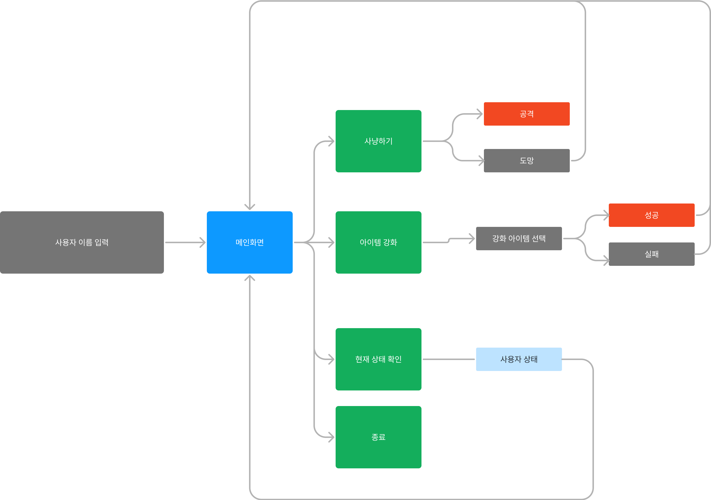

# 과제
### 텍스트 기반 테스트 기반

## Architecture
- application package
    - view class
    - controller class
    - service class
    - DAO (X)
    - DTO : view -> service 까지 데이터 이동
    - service에서 entity로 데이터 이동 (row 생성)
    - entitiy에서 service로 row 응답 후 repository에 저장
- Domain package
    - Service class
        - 핵심 로직 / 정책
        - 예) 강화 조건 등
    - entity class
    - repository class -> DAO level
- Infra package
    - 임의의 데이터베이스 생성
    - DB class
    - repository에서 DB에 저장

1. 뷰에서 사용자 입력 (scanner 사용)
2. 입력값을 DTO로 매핑
3. 매핑한 DTO를 컨트롤러에서 어플리케이션 서비스로 넘김
4. 어플리케이션 서비스에서 도메인 서비스의 조건 등을 통해 엔티티를 생성
    1. 엔티티는 데이터베이스의 클래스와 1대1 매핑되어야 함.
5. 생성된 엔티티 어플리케이션 서비스에 반환 후 도메인 레포지토리를 통해 데이터베이스에 저장

=> CQRS Command Query Responsibility Segregation

## 패키지 구조
com.ohgiraffers.{이름}
com.ohgiraffers.{이름}.{작업}
com.ohgiraffers.{이름}.{작업}.Application
com.ohgiraffers.{이름}.{작업}.Domain
com.ohgiraffers.{이름}.{작업}.infra

## 테스트
1. Domain의 Service -> 단위 테스트
2. Application의 Controller -> 통합 테스트
3. Application의 Service -> 통합 테스트

=======================================

## 기능 명세
1. 게임의 등장인물
    - 몬스터
        - 이름, HP, 공격력, 경험치, 돈
    - 아이템
        - 이름, 공격력
    - 유저
        - 이름, HP, 레벨, 소지금, 아이템, 아이템 강화레벨
2. 실행 순서
    1. 사용자 이름 입력 => 로그인
    2. 시작 메인 화면 
       1. 사냥 시작입니다...
          1. 사냥터 입장 (레벨별 => 입장 레벨보다 사용자의 레벨이 낮을 경우, 경고 메시지 출력)
            1. <사냥터 이름>
                 ...
            2. 몬스터와 조우
                1. 공격
                     - 턴제 : 사용자가 반드시 첫번째로 공격
                     - 내부 로직은 추후 상의(담당자가 알아서 개발) 사냥 성공 여부 true / false 로 return
                     - 사냥 성공 시, 보상 지급(경험치와 돈)
                2. 도망 (시작 메인 화면으로 이동)
                2. 뒤로 가기
            2. 아이템 강화
                1. 강화할 아이템 선택 (유저 sequence , 아이템 sequence)
                2. 사용자의 소지금과 아이템 강화 비용 비교 true / false 로 return
                    1. 강화 레벨이 높을수록 강화 성공 확률 하락
                3. 내부 강화 로직에 따라 강화 성공 및 실패
                    1. 성공시 : 사용자의 아이템 강화 레벨 + 1
                    2. 실패 시 : 강화 레벨 0
                4. 종료 시 시작 메인 화면으로
            3. 현재 상태 확인
                1. 사용자의 상태 다 마구마구 다 봐버리기
                2. 메인가기
            4. 종료

## Service Domain Logic
1. 아이템 강화 로직 요구사항
   1. 아이템 강화 레벨에 높아질수록 강화 성공 확률이 낮아져야 한다.
   2. 강화가 실패할 경우 아이템의 강화 레벨이 0이 되어야 한다.
   3. 강화 성공 확률이 상식적인 변동이어야 한다.
   4. 강화 성공 확률이 추적 가능해야 한다. (같은 파라미터를 입력하면 같은 성공 확률이 나와야 한다.)

## Architecture -> Spring
- application package
    - view class (1개)
    - controller class (사냥, 강화, 상태 확인)
    - service class (사냥, 강화, 상태 확인)
    - DTO : view -> service 까지 데이터 이동
    - service에서 entity로 데이터 이동 (row 생성)
    - entitiy에서 service로 row 응답 후 repository에 저장
- Domain package
    - Service class (사냥, 강화, 상태 확인)
        - 핵심 로직 / 정책
        - 예) 강화 조건 등
    - entity class (몬스터, 아이템, 유저)
    - repository class -> DAO level (몬스터, 아이템, 유저)
- Infra package
    - 임의의 데이터베이스 생성
    - DB class (몬스터, 아이템, 유저)
    - repository에서 DB에 저장

========
아이템 리스트의 조회, 업데이트, 삭제 등은 DB class에서
repository는 위 메소드를 단순 호출하는 형태
DTO는 view부터 기능 단위로 각각 만들 수 있음
Application main 메소드는 view의 메인 화면 하나 호출 
